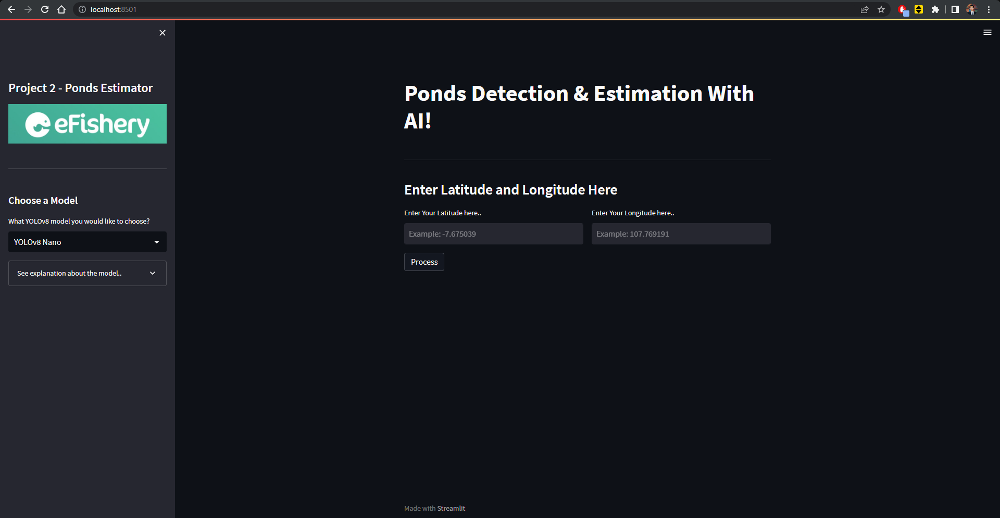
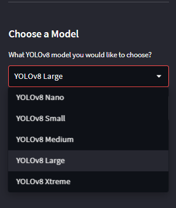
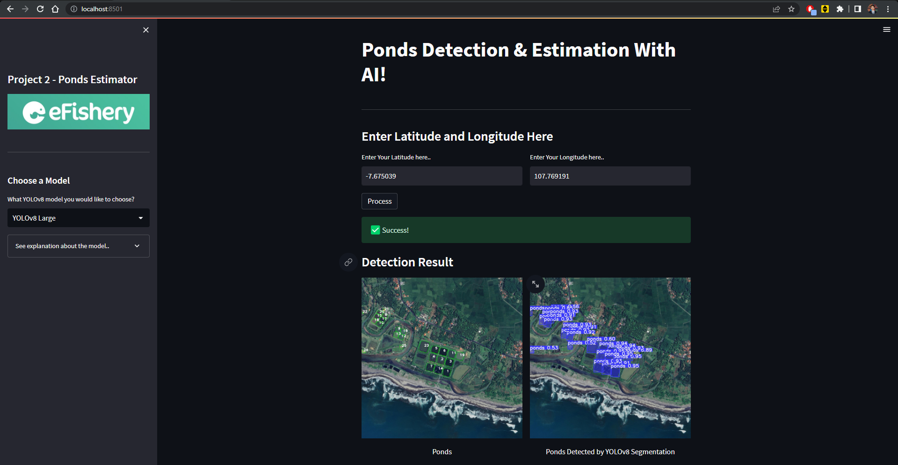
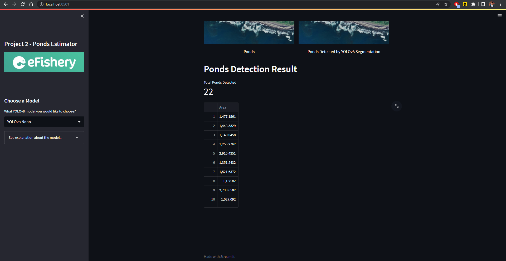

<div align="center" style="text-align: center">

<p style="text-align: center">
  
</p>

</div>

# eFishery Task 3 - Ponds Detection & Size Estimator
<p> Hi.. </p>
The purpose of this project is to be able detect and estimate the size of ponds from a longitude and latitude data.
<br>
This is also part of take home test for applying Machine Learning Computer Vision Engineer in eFishery.

## Problem
Gibran is a member of eFishery Point who was assigned to map 5 shrimp ponds in 5 different places in Indonesia in one day.
<br>
However, the distance between these 5 pools is far enough to be reached even if you use a land vehicle. So it is not possible to conduct surveys directly to the field.
Gibran need a program that can detect and estimate size of the shirimp ponds by just giving the location coordiantes, by giving latitude and longitude data.
  
## Idea & Solution
To make Gibran live easier, we create a web based platform to be able detect shrimp ponds and estimate its size.
Deep learning approach were made to solved this problem, by using YOLOv8 (You Only Look Once version 8) to segmented the shirmp ponds

  How it work
  1. Prepare the dataset, annotate the image, and export it into YOLOv8 format (I used Roboflow to do this).
  2. Train the pretrained models of YOLOv8 with our dataset (link train.ipynb).
  3. Use ClearML to tracks and controls the process, performance metrics, and model storing.
  4. Create the platform using streamlit and inference the image using the our trained model.
  5. Make a calculation based on pixel and the actual map zoom level ratio.
  
## Installation and Usage
Here is the instruction about how to install and run the program.
<br>
### PYTHON USAGE
1. Clone this git repo, you can download or use commmand below
```
git clone https://github.com/aditya39/eFishery_Task2_PondsDetection.git
```
2. Install depedency (Recommend to create Virtual Environtment first before doing this step)
   Enter the project directory then run this command in CLI like CMD:
```
pip install -r requirements.txt
```
4. To run the program, run this command below on CLI
```
streamlit run app.py
```
5. Browser will automatically open, if not, type localhost:8501 to broweser address. Web application page will be open.

### DOCKER COMPOSE
1. Clone this git repository by run command below.
```
git clone https://github.com/aditya39/eFishery_Task2_PondsDetection.git
```
2. To run the app, open CLI on the directory of the program and run this command.
```
docker-compose up
```
3. Wait to load and install depedency, after done you can go to browser and run localhost:8501, app should be running.
4. To stop the docker, run this command.
```
docker-compose down
```

## Demo
### Input gambar
<p style="text-align: center">
  
</p>

### Choose model
<p style="text-align: center">
  
</p>

### Result
<p style="text-align: center">
  
</p>
<p style="text-align: center">
  
</p>
